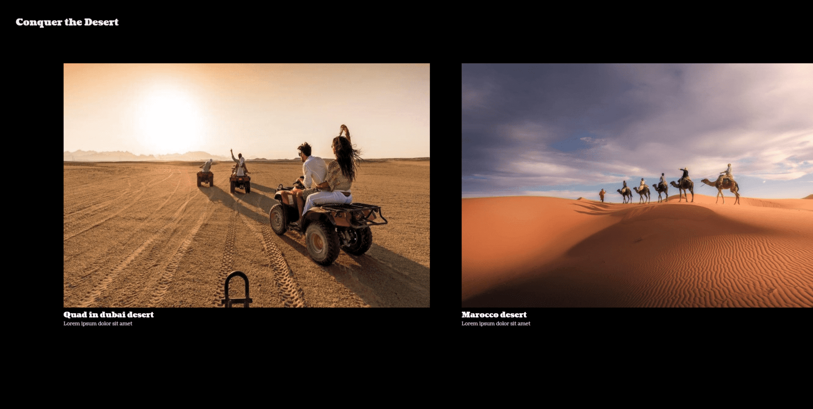

# Conquer the Desert Three.js & Eleventy



Portfolio website with Three.js page transitions adapted on Elevnty. App link : [https://transition-zoom-effect-eleventy.vercel.app/](https://transition-zoom-effect-eleventy.vercel.app/).

Before doing this project on Eleventy, I first did the project on Vite. The repository is available [here](https://github.com/killian-dv/transition-zoom-effect-threejs).

## Built With

Project is created with:

- [Eleventy](https://www.11ty.dev/)
- [Three.js](https://threejs.org/)

## Installation

```bash
npm install
npx @11ty/eleventy
```
